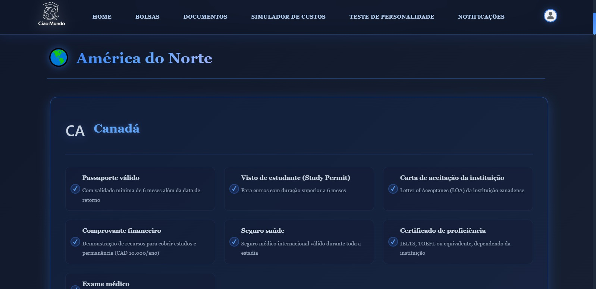
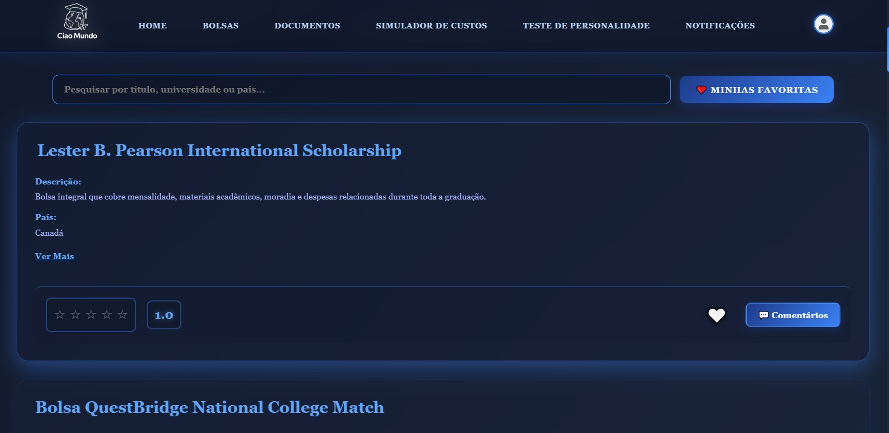

# 🌍 CiaoMundo - Study Abroad Platform

## 📌 Sobre o projeto
O CiaoMundo é uma plataforma web desenvolvida para auxiliar estudantes brasileiros na busca por bolsas de estudo internacionais, reunindo informações, filtros personalizados e ferramentas de planejamento em um único lugar.

---

## 👩‍💻 Minha contribuição
Atuei principalmente no desenvolvimento do **frontend**, sendo responsável por:

- Construção das interfaces do sistema
- Estruturação das páginas com HTML, CSS e JavaScript
- Implementação da navegação e experiência do usuário
- Integração com o backend

---

## 🚀 Tecnologias utilizadas

### Frontend
- HTML5
- CSS3
- JavaScript

### Backend
- Node.js
- Express

### Banco de Dados
- MySQL

---

## ⚙️ Como rodar o projeto

### 1. Clonar o repositório

```bash
git clone https://github.com/mariaclaracagniato/CiaoMundo-Study-Abroad-Management-System.git
cd CiaoMundo-Study-Abroad-Management-System

2. Instalar dependências
npm install
3. Configurar o banco de dados

Crie um banco chamado:

sistema_bolsas

Importe o arquivo .sql disponível no projeto

4. Configurar o ambiente

Crie um arquivo .env com base no .env.example:

DB_HOST=localhost
DB_USER=seu_usuario
DB_PASSWORD=sua_senha
DB_NAME=sistema_bolsas
PORT=3000
JWT_SECRET=sua_chave
5. Executar o projeto
npm start
6. Acessar no navegador
http://localhost:3000


🧠 Funcionalidades

Visualização de bolsas de estudo

Filtros por país, curso e universidade

Sistema de login e cadastro

Simulação de custos

Favoritar bolsas

Área administrativa


## 📸 Preview




